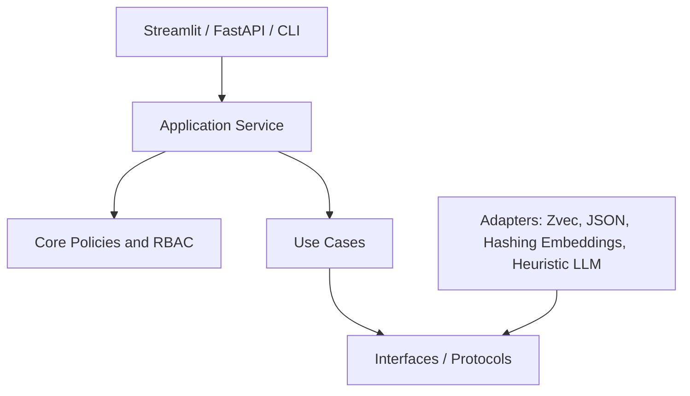
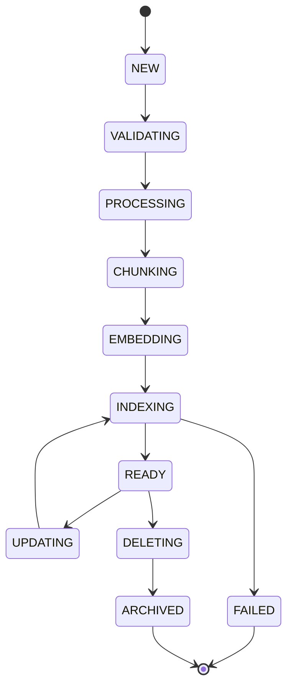
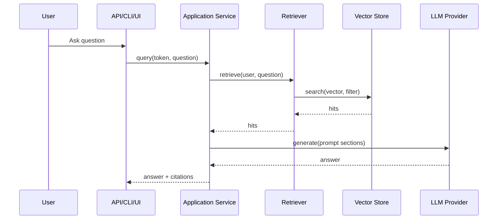

# Architecture

## Layering

```mermaid
flowchart TB
  UI[Streamlit / FastAPI / CLI]
  APP[Application Service]
  CORE[Core Policies and RBAC]
  USE[Use Cases]
  INTF[Interfaces / Protocols]
  ADAPT[Adapters: Zvec, JSON, Hashing Embeddings, Heuristic LLM]
  UI --> APP
  APP --> CORE
  APP --> USE
  USE --> INTF
  ADAPT --> INTF
```

## Document Lifecycle

```mermaid
stateDiagram-v2
  [*] --> NEW
  NEW --> VALIDATING
  VALIDATING --> PROCESSING
  PROCESSING --> CHUNKING
  CHUNKING --> EMBEDDING
  EMBEDDING --> INDEXING
  INDEXING --> READY
  INDEXING --> FAILED
  READY --> UPDATING
  READY --> DELETING
  DELETING --> ARCHIVED
  UPDATING --> INDEXING
  FAILED --> [*]
  ARCHIVED --> [*]
```

## Query Flow

```mermaid
sequenceDiagram
  participant U as User
  participant API as API/CLI/UI
  participant APP as Application Service
  participant RET as Retriever
  participant VS as Vector Store
  participant LLM as LLM Provider
  U->>API: Ask question
  API->>APP: query(token, question)
  APP->>RET: retrieve(user, question)
  RET->>VS: search(vector, filter)
  VS-->>RET: hits
  RET-->>APP: hits
  APP->>LLM: generate(prompt sections)
  LLM-->>APP: answer
  APP-->>API: answer + citations
```

